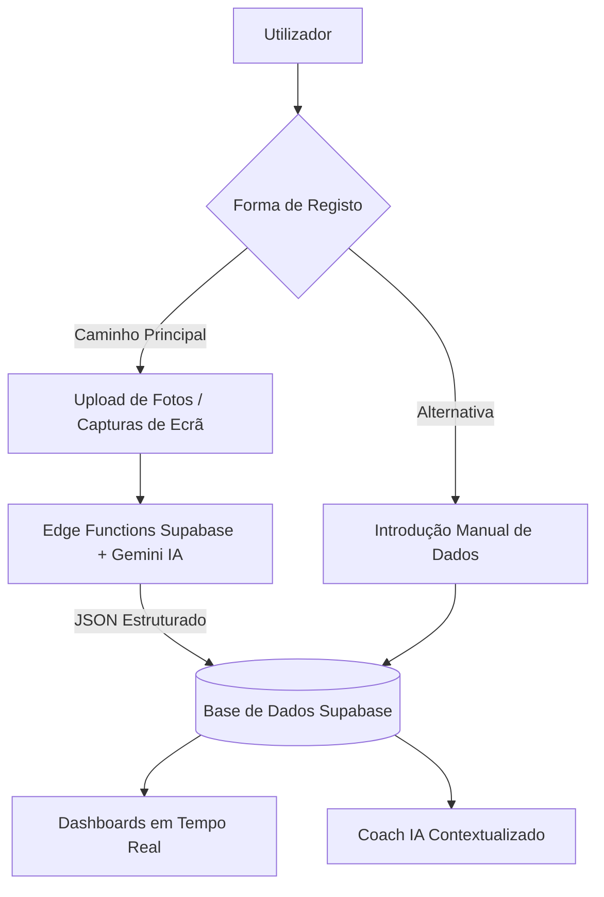
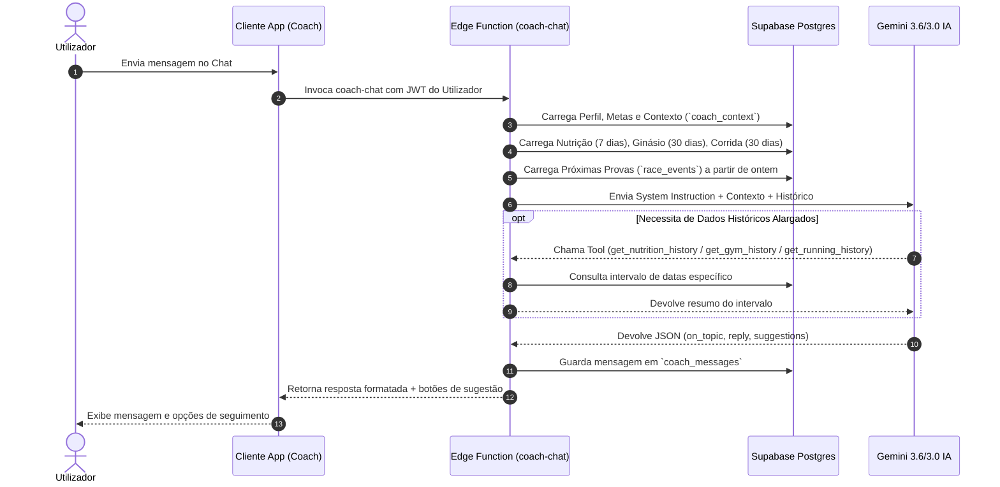
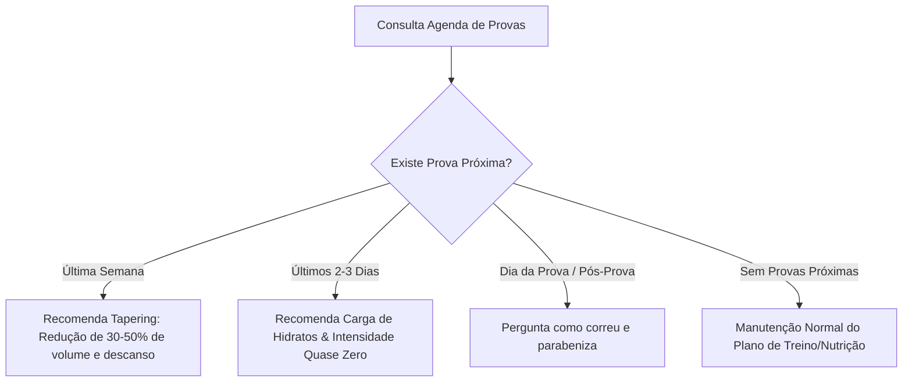

# 📖 Manual do Utilizador — IronHealth v2 (`master`)
> **Guia Completo de Regras de Negócio, Validações, Métricas, Cálculo de Dashboards e Engine do Coach IA**

Bem-vindo ao **IronHealth v2**, a plataforma inteligente tudo-em-um desenvolvida para corredores e atletas amadores sérios. Este manual especifica exaustivamente todas as regras de preenchimento de campos, fórmulas matemáticas de cálculo de métricas e dashboards, bem como as diretrizes de funcionamento do **Coach IA**, alinhado rigorosamente com a versão em produção no ramo `master`.

---

## 📋 Índice

1. [Visão Geral e Filosofia da Aplicação](#1-visão-geral-e-filosofia-da-aplicação)
2. [Arquitetura de Dados & Fluxos Visuais](#2-arquitetura-de-dados--fluxos-visuais)
3. [Módulo 1: Início (Dashboard Resumo & Hidratação)](#3-módulo-1-início-dashboard-resumo--hidratação)
4. [Módulo 2: Nutrição (Fotos, Macros & Água)](#4-módulo-2-nutrição-fotos-macros--água)
5. [Módulo 3: Ginásio (Treinos de Força & Aulas de Grupo)](#5-módulo-3-ginásio-treinos-de-força--aulas-de-grupo)
6. [Módulo 4: Corpo (Composição Corporal Renpho)](#6-módulo-4-corpo-composição-corporal-renpho)
7. [Módulo 5: Corrida (Treinos, Splits & Agenda de Provas)](#7-módulo-5-corrida-treinos-splits--agenda-de-provas)
8. [Módulo 6: Coach IA (Engine, Prompts & Automação)](#8-módulo-6-coach-ia-engine-prompts--automação)
9. [Perfil, Definições & Painel Admin](#9-perfil-definições--painel-admin)

---

## 1. Visão Geral e Filosofia da Aplicação

O **IronHealth** assenta em três pilares fundamentais:

1. **Registo com Fricção Mínima (Multimodal por Foto/Print em 1º Lugar)**:
   Em vez de formulários extensos, o utilizador pode simplesmente carregar uma foto da refeição, um print da app de corrida (Strava, Garmin, Nike Run Club), uma captura da balança inteligente (Renpho Health) ou do plano/ecrã de ginásio. A IA Gemini 3.6/3.0 extrai e valida automaticamente os dados estruturados.
2. **Dados Centralizados e Unificados**:
   Todos os módulos partilham a mesma base de dados em **Supabase Postgres**. Não existem silos entre nutrição, treino de força, corrida e composição corporal.
3. **Coach IA Proativo em Português de Portugal (`pt-PT`)**:
   O treinador pessoal virtual tem visibilidade global sobre todo o histórico do utilizador e adapta-se proativamente aos objetivos e proximidade de provas agendadas.

---

## 2. Arquitetura de Dados & Fluxos Visuais

### 🔄 Fluxo de Registo e Análise Multimodal

### 🧠 Sequência de Funcionamento do Coach IA

---

## 3. Módulo 1: Início (Dashboard Resumo & Hidratação)

O ecrã **Início** funciona como o painel central de comando do atleta.

### 📊 Regras de Campos e Preenchimento

| Cartão / Elemento | Tipo / Origem | Opcional | Descrição e Regras |
| :--- | :--- | :--- | :--- |
| **Consumo Calórico Fixo** | Acumulado do dia | Não | Cartão fixo no topo. Compara o total de kcal ingeridas hoje com a meta do perfil (`calorie_goal`). |
| **Tracker de Hidratação** | Registo diário (`water_logs`) | Sim | Registo de consumo de água em mililitros. Presets rápidos de `200ml`, `250ml`, `300ml` e `500ml` ou introdução manual. |
| **Meta de Água** | Perfil (`water_goal_ml`) | Não | Valor por defeito de `2000 ml` se não definido. |
| **Layout Personalizável** | Perfil (`home_layout`) | Sim | Array de strings que define a ordem e visibilidade dos cartões dinâmicos. |

### 🧮 Fórmulas de Cálculo e Lógicas do Dashboard

1. **Percentagem de Ingestão Calórica**:
   $$\text{Progresso Calórico (\%)} = \left( \frac{\sum \text{Calorias das refeições de hoje}}{\text{calorie\_goal}} \right) \times 100$$
2. **Percentagem de Hidratação**:
   $$\text{Progresso de Água (\%)} = \left( \frac{\sum \text{Lançamentos de água de hoje (ml)}}{\text{water\_goal\_ml}} \right) \times 100$$
3. **Cálculo de Paces Destacados (5k / 10k / 21k / 42k)**:
   - Se a corrida tiver **Splits** específicos gravados para a distância (ex: split dos 10k), utiliza a marca temporal real do split.
   - Caso contrário, calcula o pace médio da corrida inteira:
     $$\text{Pace Médio (min/km)} = \frac{\text{Duração Total em Segundos}}{\text{Distância Total em km} \times 60}$$

---

## 4. Módulo 2: Nutrição (Fotos, Macros & Água)

O módulo de Nutrição gere a ingestão calórica, macronutrientes e micronutrientes sem fricção.

### 🥗 Tipos de Refeição e Validações

* **Tipos Suportados (`meal_type`)**:
  - `pequeno-almoco` (Pequeno-almoço)
  - `lanche-manha` (Lanche da Manhã)
  - `almoco` (Almoço)
  - `lanche` (Lanche da Tarde)
  - `jantar` (Jantar)
  - `ceia` (Ceia)
* **Sugestão Automática de Tipo**: A aplicação sugere automaticamente o tipo de refeição com base no horário atual do dispositivo (ex: 12h-15h sugere `almoco`). O utilizador pode alterar manualmente a qualquer momento.
* **Fotos (`meal_photos`)**: Até 6 fotos por refeição.
* **Componentes Nutricionais por Item (`meal_items`)**:
  - Nome do alimento (`name`) — Texto obrigatório.
  - Gramagem (`quantity_grams`) — Numérico positivo (g).
  - Valores por 100g: `calories_per_100g`, `protein_per_100g`, `carbs_per_100g`, `fat_per_100g`, `fiber_per_100g`, `sugar_per_100g`, `sodium_per_100g`, `calcium_per_100g`, `iron_per_100g`, `vit_c_per_100g`, `potassium_per_100g`.

### ⚡ Regra Nutricional por 100g (Cálculo no Cliente)

Para permitir a alteração instantânea da porção pelo utilizador sem necessitar de recarregar a IA:

$$\text{Valor Finais} = \frac{\text{Quantidade em gramas}}{100} \times \text{Valor por 100g}$$

### 📅 Indicadores do Calendário de Nutrição
No Calendário Nutricional, um dia fica assinalado com cor de alerta sempre que o consumo acumulado ultrapassa alguma das metas diárias de macronutrientes (`calorie_goal`, `protein_goal`, `carbs_goal`, `fat_goal`).

---

## 5. Módulo 3: Ginásio (Treinos de Força & Aulas de Grupo)

O módulo de Ginásio suporta registo flexível de treino com pesos e aulas coletivas.

### 🏋️ Regras de Campos e Distinção de Treinos

| Campo | Tipo | Validação / Regras |
| :--- | :--- | :--- |
| **Estado (`status`)** | Enum | `em-curso` (em execução) ou `concluido` (finalizado). |
| **Tipo (`kind`)** | Enum | `forca` (Treino de força tradicional) ou `aula` (Aula de grupo/cardio: HIIT, RPM, Pilates, etc.). |
| **Nome da Sessão (`name`)** | Texto | Nome livre (ex: *"Superiores + Core"* ou *"Aula de RPM"*). |
| **Duração (`duration_seconds`)** | Inteiro | Duração total da sessão em segundos. |
| **Calorias (`calories_kcal`)** | Inteiro | Gasto calórico estimado da sessão. |
| **Frequência Cardíaca (`avg_hr`, `max_hr`)** | Inteiro | FC média e FC máxima em bpm. |
| **Perceção de Esforço (`exertion`)** | Inteiro (1-10) | Escala RPE de esforço sentido durante o treino. |
| **Grupos Musculares (`categories`)** | Array de Texto | Tags dos músculos trabalhados (ex: `[Peitoral, Tríceps]`). |

### 🧮 Regra de Cálculo de Volume Total de Treino

Para **Treinos de Força** (`kind="forca"`):
$$\text{Volume da Sessão (kg)} = \sum_{i=1}^{n} (\text{Repetições}_i \times \text{Carga en kg}_i)$$

> [!IMPORTANT]
> **Regra das Aulas de Grupo (`kind="aula"`)**:
> As aulas de grupo/cardio **não possuem séries nem carga em kg** (volume = 0). O sistema e o Coach IA reconhecem explicitamente que uma aula sem volume é um treino válido de alta intensidade e **nunca a contabilizam como treino falhado**.

---

## 6. Módulo 4: Corpo (Composição Corporal Renpho)

Módulo dedicado à análise avançada de composição corporal através de capturas da balança **Renpho Health**.

### 📱 Tabela dos 13 Indicadores Corporais

Ao carregar prints da app Renpho, a IA Gemini extrai e valida os seguintes 13 indicadores:

| Métrica | Chave | Unidade | Direção Ideal da Meta |
| :--- | :--- | :---: | :---: |
| **Peso** | `weight_kg` | `kg` | Neutro / Conforme objetivo |
| **IMC (BMI)** | `bmi` | `kg/m²` | Diminuir (`down`) |
| **Gordura Corporal** | `body_fat_pct` | `%` | Diminuir (`down`) |
| **Músculo Esquelético** | `skeletal_muscle_pct` | `%` | Aumentar (`up`) |
| **Massa Muscular** | `muscle_mass_kg` | `kg` | Aumentar (`up`) |
| **Água Corporal** | `body_water_pct` | `%` | Aumentar (`up`) |
| **Proteína** | `protein_pct` | `%` | Aumentar (`up`) |
| **Massa Óssea** | `bone_mass_kg` | `kg` | Neutro |
| **Metabolismo Basal (BMR)** | `bmr_kcal` | `kcal` | Aumentar (`up`) |
| **Gordura Visceral** | `visceral_fat` | Nível | Diminuir (`down`) |
| **Gordura Subcutânea** | `subcutaneous_fat_pct` | `%` | Diminuir (`down`) |
| **Idade Metabólica** | `metabolic_age` | Anos | Diminuir (`down`) |
| **Massa Magra** | `lean_body_mass_kg` | `kg` | Aumentar (`up`) |

### ⭕ Regra dos Anéis de Progresso e Calendário
Cada métrica possui uma meta associada (`goal_*`).
* **Anel de Progresso**: Mostra a percentagem de aproximação à meta individual.
* **Calendário do Corpo**: Um dia fica marcado no calendário quando alguma métrica com meta definida **se afastou** da meta em comparação com a avaliação anterior.

---

## 7. Módulo 5: Corrida (Treinos, Splits & Agenda de Provas)

Módulo técnico especializado para treinos de corrida e preparação para competições.

### 🏃 Tipos de Evento e Categorias

1. **Tipos de Evento (`kind`)**: `simples`, `treino`, `competicao`.
2. **Categorias de Treino (`training_type`)**:
   - `continuo` (Contínuo)
   - `longo` (Treino Longo)
   - `tempo` (Tempo / Limiar Anaeróbico)
   - `recuperacao` (Regenerativo)
   - `fartlek` (Fartlek)
   - `intervalos` (Intervalado / Séries)
   - `subidas` (Treino de Subidas)
   - `trail` (Corrida de Montanha)
   - `tecnico` (Exercícios Técnicos de Corrida)
3. **Escala RPE (`exertion`)**: Classificação de 1 a 10 da perceção subjetiva de esforço.
4. **Agenda de Provas (`race_events`)**:
   - Campos: `date` (Data), `name` (Nome da Prova), `race_type` (`estrada`, `trail`, `ultra`, `5k`, `10k`, `21k`, `42k`, `outro`), `location` (Local), `target_time` (Tempo-Alvo), `status` (`agendada` / `concluida`).
   - Contagem Decrescente: Calculada no cliente e enviada ao Coach IA em dias restantes.

---

## 8. Módulo 6: Coach IA (Engine, Prompts & Automação)

O **Coach IA** atua como treinador pessoal e nutricionista dedicado em Português de Portugal (`pt-PT`).

### 📐 Janelas de Contexto Automáticas
Ao ser invocado, o `coach-chat` constrói automaticamente o seguinte contexto:
* **Nutrição**: Resumo diário dos últimos **7 dias** (calorias, macros, nº de refeições).
* **Ginásio**: Sessões concluídas dos últimos **30 dias** (diferenciando força vs. aulas).
* **Corrida**: Corridas dos últimos **30 dias** (distância, duração, pace, tipo).
* **Hidratação**: Total de água do próprio dia vs. meta.
* **Agenda de Provas**: Provas agendadas a partir do dia anterior.

### 🛠️ Invocação Dinâmica de Ferramentas (Function Calling)
Quando o utilizador faz perguntas fora das janelas padrão (ex: *"Como esteve o meu treino em Maio?"*), o Gemini invoca autonomamente as funções:
1. `get_nutrition_history(start_date, end_date)`
2. `get_gym_history(start_date, end_date)`
3. `get_running_history(start_date, end_date)`

### 🏁 Algoritmo de Proatividade perante Provas Agendadas

### 🎯 Automação de Objetivos no Perfil (`suggest-goals`)
Através da função `suggest-goals` no Perfil, o Coach analisa todo o histórico e gera sugestões realistas para `goal_*` de Corpo e metas de Nutrição.
* **Salvaguarda de Segurança**: O algoritmo proíbe explicitamente a sugestão de défices calóricos agressivos ou perda rápida de peso perto de meias-maratonas e maratonas.

### 🛡️ Guardrails e Regras Formais de Resposta
- **Validação de Âmbito (`on_topic`)**: Se a pergunta for alheia a desporto, nutrição ou app, devolve `on_topic: false` sem gerar resposta vaga.
- **Foco Estrito**: Responde apenas ao que foi perguntado, sem expandir sem pedido para outros temas.
- **Sugestões em Botão (`suggestions`)**: Até 3 perguntas de seguimento curtas na primeira pessoa (ex: *"Dá-me a lista de compras para hoje"*).

---

## 9. Perfil, Definições & Painel Admin

### 🎨 Personalização do Perfil
* **Biometria**: `height_cm`, `weight_kg`, `gender` (`M`/`F`).
* **Cores de Destaque (`accent_color`)**: 12 opções vibrantes (Laranja, Âmbar, Coral, Teal, Sky, Steel, Plum, Fuchsia, Pink, Green, Lime, Turquoise).
* **Contexto Pessoal (`coach_context`)**: Campo de texto livre enviado em todas as chamadas ao Coach (ex: *"Objetivo: Sub 1h40 na Meia Maratona"*).

### 🛠️ Monitorização & Custos de API (`app_logs`)
O painel de Administrador (`is_admin = true`) regista todas as chamadas ao Gemini na tabela `app_logs`, armazenando `input_tokens` e `output_tokens` para calcular em tempo real os custos de utilização da API.

---
*Manual oficial atualizado em conformidade com o repositório IronHealth v2 (branch `master`).*
