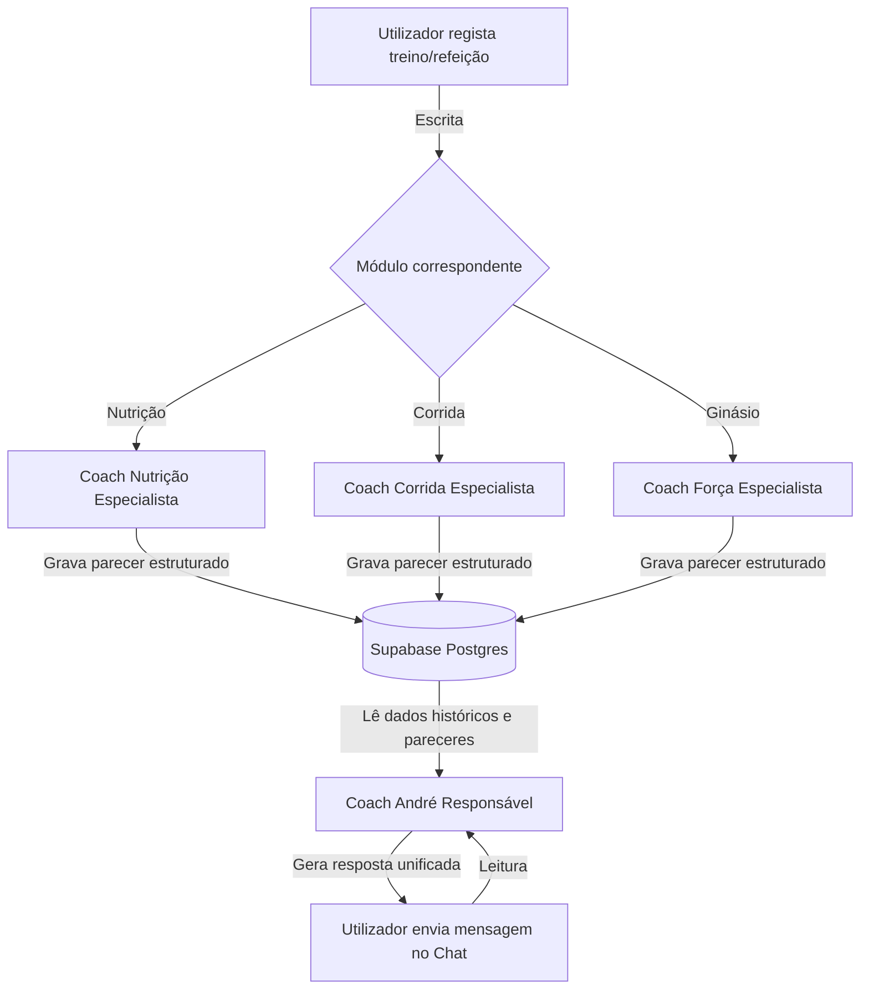

# 📐 Arquitetura de IA & Doutrina do Coach

Este documento descreve a infraestrutura de Inteligência Artificial da plataforma, a orquestração dos coaches especialistas e a doutrina desportiva que governa os conselhos e automações.

---

## 📋 Conteúdo
1. [Orquestração de Agentes (A Equipa de 4 Coaches)](#1-orquestração-de-agentes-a-equipa-de-4-coaches)
2. [Janelas de Contexto & Funcionamento Técnico](#2-janelas-de-contexto--funcionamento-técnico)
3. [Doutrina & Limiares Fisiológicos](#3-doutrina--limiares-fisiológicos)
4. [Tapering & Carbloading](#4-tapering--carbloading)

---

## 1. Orquestração de Agentes (A Equipa de 4 Coaches)

O IronHealth v2 utiliza um modelo de **orquestração distribuída na escrita** para garantir respostas rápidas, baratas e sem alucinações.

### 👥 Papel de cada Coach
1. **Coach André (Responsável / Head Coach)**:
   É o único que fala com o utilizador no chat principal. Ele não analisa imagens em tempo real; lê o perfil, o histórico de atividades e os pareceres gravados pelos especialistas, combinando-os numa resposta única e integrada.
2. **Coach de Nutrição (Especialista)**:
   Corre na Edge Function `analyze-meal`. Analisa a foto ou lista de alimentos, calcula macros e guarda as `coach_notes`.
3. **Coach de Corrida (Especialista)**:
   Corre na Edge Function `analyze-run`. Processa a corrida e as métricas do relógio, guardando a sua análise em `coach_notes`.
4. **Coach de Força (Especialista)**:
   Corre na Edge Function `analyze-gym`. Analisa a musculação, exercícios e séries, guardando a sua análise em `coach_notes`.

---

## 2. Janelas de Contexto & Funcionamento Técnico

Para otimizar o consumo de tokens e a precisão do modelo Gemini 1.5 / Flash, a chamada principal do chat constrói um payload dinâmico com limites estritos:

| Módulo / Dados | Janela Padrão | Métricas Disponíveis |
| :--- | :--- | :--- |
| **Nutrição & Água** | Últimos **7 dias** + dia corrente | Kcal consumidas, macros (P/C/G), total de água do dia. |
| **Corrida & Provas** | Últimos **30 dias** + todas as provas futuras | Distância, tempo, pace médio, splits, desnível, batimentos e RPE. |
| **Ginásio & Força** | Últimos **30 dias** | Duração, categorias trabalhadas, volume-carga, RPE e batimentos. |
| **Composição Corporal** | Últimas **5 pesagens** | Histórico das métricas da balança inteligente e classificação de metas. |

### 🛠️ Function Calling (Ferramentas)
Caso o utilizador faça perguntas sobre dados mais antigos (ex: *"Qual foi o meu peso médio em março?"*), a IA aciona automaticamente ferramentas integradas para estender o contexto:
* `get_nutrition_history(startDate, endDate)`
* `get_gym_history(startDate, endDate)`
* `get_running_history(startDate, endDate)`

### 🛡️ Guardrails e Respostas Focadas
* **On-Topic Check**: Se a pergunta for alheia a desporto, saúde ou ao funcionamento da app, o Coach devolve `on_topic: false` no JSON e exibe um aviso educado para regressar ao tema do projeto.
* **Sugestões Rápidas**: O Coach gera até 3 botões com perguntas curtas de seguimento na primeira pessoa (ex: *"Como ajusto o meu jantar?"*).

---

## 3. Doutrina & Limiares Fisiológicos

Os limiares de volume, fadiga e progressão estão indexados em `specs/coach-investigacao.md` e dividem-se em 4 níveis (Iniciante, Básico, Médio e Avançado).

### 📊 Tabela de Critérios de Nível (Bloco 0)
* **Iniciante**: Volume semanal < 15km; corrida mais longa < 5km; corre 1-2 vezes por semana; sem experiência prévia.
* **Básico**: Volume semanal 15-30km; corrida mais longa 5-12km; corre 2-3 vezes por semana; < 1 ano de prática.
* **Médio**: Volume semanal 30-60km; corrida mais longa 12-21km; corre 3-4 vezes por semana; 1-3 anos de prática.
* **Avançado**: Volume semanal > 60km; corrida mais longa > 21km; corre 4+ vezes por semana; > 3 anos de prática continuada.

### ⚠️ Regras de Segurança e Sobrecarga (Bloco 2.1)
* **Progressão Semanal**: Aumento máximo de volume semanal recomendado:
  * Iniciante / Básico: **10%** face à semana anterior.
  * Médio / Avançado: **10-15%** com base no rácio de carga aguda/crónica.
* **Longão Desproporcionado**: A corrida mais longa da semana não deve exceder **30% a 35%** do volume total semanal (exceto em fases específicas de treino de maratona para atletas avançados).
* **Frequência Insuficiente**: O Coach alerta para a perda de adaptações se a frequência de corrida for inferior a **2 vezes por semana** (Iniciante) ou **3 vezes por semana** (Básico/Médio/Avançado).

---

## 4. Tapering & Carbloading

Toda a análise do Coach é orientada aos objetivos do atleta, priorizando a **próxima prova do calendário** (`race_events`).

### 📉 Algoritmo de Tapering (Última Semana da Prova)
* **Redução de Volume**: Recomendação ativa de corte de **30% a 50%** no volume de kms corridos na semana da prova.
* **Intensidade**: Manutenção de estímulos de ritmo de prova curtos, eliminando treinos que gerem fadiga neuromuscular duradoura.
* **Ginásio**: Suspensão de treinos de força intensos (reduzir carga em 50% ou fazer apenas mobilidade e alongamentos).

### 🍞 Carbloading (Últimos 2-3 Dias)
* **Aumento de Hidratos**: O Coach sugere a elevação da meta diária de hidratos de carbono (carbs) para **7g a 10g por kg de peso** em provas de longa distância (meia-maratona e maratona).
* **Meta de Água**: Exigência reforçada de hidratação (meta de água sobe em 500-1000ml).

### 🛡️ Salvaguardas Nutricionais de Performance
* **Défices Proibidos**: O algoritmo `suggest-goals` impede ativamente qualquer meta de perda de peso ou défice calórico significativo num raio de **10 dias** antes de meias-maratonas ou maratonas, priorizando a performance e prevenindo a síndrome RED-S (Deficiência Energética Relativa no Desporto).
