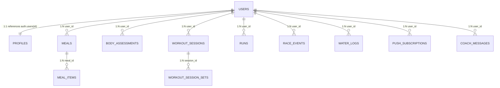

# 💾 Modelo de Dados & Regras Supabase

Este documento especifica a estrutura física das tabelas de base de dados, as políticas de segurança RLS (Row Level Security), funções de base de dados, triggers e constrangimentos.

---

## 📋 Conteúdo
1. [Diagrama de Relações (MER)](#1-diagrama-de-relações-mer)
2. [Dicionário de Tabelas](#2-dicionário-de-tabelas)
3. [Segurança & Row Level Security (RLS)](#3-segurança--row-level-security-rls)
4. [Funções, Triggers & Background Jobs](#4-funções-triggers--background-jobs)

---

## 1. Diagrama de Relações (MER)

O modelo de dados do IronHealth v2 é estruturado em torno do utilizador (`auth.users`), onde o perfil e todos os módulos funcionais se ligam através de chaves estrangeiras.

---

## 2. Dicionário de Tabelas

### 👤 profiles
Guarda os dados biométricos, objetivos e configurações de cada utilizador.
* `id` (uuid, primary key): Referência a `auth.users(id)` com delete cascade.
* `display_name` (text, not null, default '').
* `calorie_goal` (numeric, default 2000).
* `protein_goal` (numeric, default 150).
* `carbs_goal` (numeric, default 200).
* `fat_goal` (numeric, default 70).
* `accent_color` (text, default 'amber'): check constraints em orange, amber, coral, teal, sky, steel, plum, fuchsia, pink, green, lime, turquoise.
* `theme` (text, default 'dark'): check constrains em dark, light.
* `coach_context` (text, default '').
* `height_cm` (numeric), `weight_kg` (numeric), `gender` (text check M/F).
* `birth_date` (date): data de nascimento do utilizador.
* `experience_level` (text): check constrains em iniciante, basico, medio, avancado.
* `water_goal_ml` (integer, default 2000).
* `water_reminder_enabled` (boolean, default false).
* `water_reminder_interval_minutes` (integer, default 120).
* `water_last_activity_at` (timestamptz).
* `water_reminder_muted_date` (date).
* `water_reminder_start_hour` (smallint, default 8): check between 0 and 23.
* `water_reminder_end_hour` (smallint, default 22): check between 0 and 23.
* `is_admin` (boolean, default false).

### 🥗 meals
* `id` (uuid, primary key, default gen_random_uuid()).
* `user_id` (uuid, not null references auth.users).
* `date` (date, not null).
* `meal_type` (text, not null check pequeno-almoco, lanche-manha, almoco, lanche, jantar, ceia).
* `photo_paths` (text[], default '{}').
* `status` (text check pending, analyzing, ready, failed).
* `notes` (text).
* `coach_notes` (text): notas analíticas do Coach.

### 🍏 meal_items
* `id` (uuid, primary key).
* `meal_id` (uuid, references meals on delete cascade).
* `user_id` (uuid, references auth.users).
* `name` (text, not null).
* `quantity_grams` (numeric check >= 0).
* Macros por 100g: `calories_per_100g`, `protein_per_100g`, `carbs_per_100g`, `fat_per_100g`, `fiber_per_100g`, `sugar_per_100g`, `sodium_per_100g`, `iron_mg_per_100g`, `calcium_mg_per_100g`, `vitamin_c_mg_per_100g`, `potassium_mg_per_100g`.

### 🏋️ workout_sessions
* `id` (uuid, primary key).
* `user_id` (uuid, references auth.users).
* `date` (date).
* `name` (text).
* `status` (text check em-curso, concluido).
* `kind` (text check forca, aula).
* `duration_seconds` (integer check > 0).
* `calories_kcal` (integer check >= 0).
* `avg_hr`, `max_hr` (integer check > 0 and < 300).
* `categories` (text[]): tags de grupos musculares trabalhados.
* `exertion` (smallint check between 1 and 10).
* `coach_notes` (text).

### 🔢 workout_session_sets
* `id` (uuid, primary key).
* `session_id` (uuid, references workout_sessions on delete cascade).
* `user_id` (uuid, references auth.users).
* `exercise_name` (text).
* `set_index` (integer).
* `reps` (integer).
* `weight` (numeric).

### 🏃 runs
* `id` (uuid, primary key).
* `user_id` (uuid, references auth.users).
* `date` (date).
* `distance_km` (numeric check > 0).
* `duration_seconds` (integer check > 0).
* `kind` (text check simples, treino, competicao).
* `training_type` (text check continuo, longo, tempo, recuperacao, fartlek, intervalos, subidas, trail, tecnico, sprints).
* `effort_rpe` (smallint check between 1 and 10).
* `split_5k_seconds`, `split_10k_seconds`, `split_21k_seconds` (integer).
* `details` (jsonb): dados completos do print (zonas de FC, voltas, cadência, etc.).
* `coach_notes` (text).

### 🏁 race_events
* `id` (uuid, primary key).
* `user_id` (uuid, references auth.users).
* `date` (date).
* `name` (text).
* `race_type` (text check estrada, trail).
* `location` (text, not null).
* `target_time` (text, not null).
* `target_time_seconds` (integer check > 0, not null).
* `target_pace_seconds_per_km` (integer check > 0, not null).
* `distance_km` (numeric check > 0, not null).
* `website` (text).
* `elevation_gain_m` (numeric check >= 0) — *Constraint: Apenas permitido (não nulo) se race_type = 'trail'*.
* `experience_level` (text check iniciante, basico, medio, avancado).

### 💧 water_logs
* `id` (uuid, primary key).
* `user_id` (uuid, references auth.users).
* `date` (date).
* `amount_ml` (integer).

---

## 3. Segurança & Row Level Security (RLS)

O Supabase impõe políticas RLS estritas a nível de linha para garantir que nenhum utilizador consegue ler ou modificar dados alheios.

* **Políticas own rows**:
  Todas as tabelas de dados têm a regra RLS padrão de validação de dono de conta:
  `using (auth.uid() = user_id) with check (auth.uid() = user_id)`
* **Políticas own profile**:
  Aplicada à tabela `profiles`:
  `using (auth.uid() = id) with check (auth.uid() = id)`
* **Políticas de Storage Buckets**:
  Para os buckets `meal-photos`, `body-photos`, `gym-photos` e `run-photos`, o acesso a ficheiros verifica se a primeira diretoria do caminho do ficheiro coincide com o ID do utilizador autenticado:
  `bucket_id = 'bucket-name' and (storage.foldername(name))[1] = auth.uid()::text`

---

## 4. Funções, Triggers & Background Jobs

### 🛠️ Funções & Permissões Especiais
1. `public.is_admin()`:
   Função estável que valida se o utilizador pertence à conta de administrador baseada no email do JWT:
   `select (auth.jwt() ->> 'email') = 'rpmariano@gmail.com';`
2. `public.admin_list_users()`:
   Função executada com permissões de `security definer` (ignora RLS) para listar os utilizadores registados na plataforma. Apenas acessível a utilizadores que passem na validação `is_admin()`.

### 🔄 Triggers
* `on_auth_user_created`:
  Trigger associada à tabela `auth.users` que executa automaticamente a função `public.handle_new_user()` após a inserção de um novo utilizador, criando de forma transparente o respetivo perfil na tabela `profiles`.

### ⏰ Lembretes Automáticos (pg_cron)
O envio de lembretes periódicos de hidratação é executado através da extensão `pg_cron` do Supabase:
* Um job automático corre a cada minuto no servidor Postgres, avaliando as definições da tabela `profiles`.
* Se o utilizador tiver lembretes ativos, a hora de Lisboa estiver dentro da janela de atividade, o tempo passado desde o último registo for superior a `water_reminder_interval_minutes` e o dia não estiver silenciado, o job invoca a Edge Function `send-water-reminders`.
