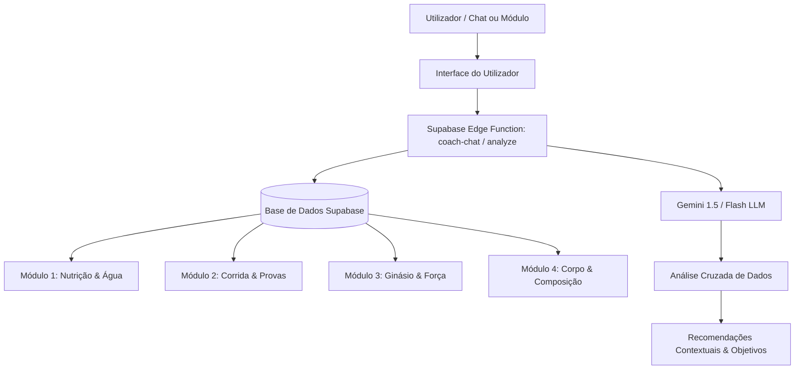

# Software Design Document (SDD) - Arquitetura de Inteligência Artificial do Coach (IronHealth)

Este documento especifica o design da arquitetura, os limites de contexto, o fluxo de dados e as regras de tomada de decisão do **Coach de Inteligência Artificial** no ecossistema IronHealth.

---

## 1. Visão Geral da Arquitetura do Coach

O Coach de IA atua como o cérebro centralizador do utilizador, quebrando os silos tradicionais de informação. Ele tem acesso completo e simultâneo a **todos os 4 módulos funcionais** da aplicação, bem como ao histórico de conversação do próprio chat.

---

## 2. Janelas de Histórico Analisadas por Módulo

Para otimizar o consumo de tokens e fornecer contexto relevante de forma eficiente, a IA recebe por padrão as seguintes janelas de histórico imediato em cada chamada:

| Módulo | Janela de Histórico Padrão | Métricas Chave Incluídas |
| :--- | :--- | :--- |
| **Nutrição & Água** | Últimos **7 dias** completos + dia de hoje | Consumo calórico (kcal), gramas de proteínas, hidratos e gorduras, número de refeições diárias e percentagem da meta de hidratação atual. |
| **Corrida & Provas** | Últimos **30 dias** de corridas + **Todas** as provas futuras | Distância total (km), tempo de movimento, ritmo (pace), zonas de frequência cardíaca (Z1 a Z5), desnível, cadência, calorias e VO2 máx. Lista de eventos/provas agendados ordenados por data. |
| **Ginásio & Força** | Últimos **30 dias** de sessões e aulas | Nome da sessão, grupo muscular trabalhado, volume total em kg (séries × repetições × carga), duração, calorias gastas, nível de esforço percebido (1-10) e tipo de sessão (força ou aula). |
| **Corpo (Composição)** | Últimas **5 avaliações** corporais | Data, peso (kg), IMC, percentagem de gordura corporal, percentagem de músculo esquelético, gordura visceral/subcutânea e classificações/etiquetas de estado. |

### 🔍 Extensão Dinâmica de Histórico (Tool Calling)
Se o utilizador solicitar uma análise fora destas janelas (ex: *"Como estava o meu peso no início do ano?"* ou *"Compara a minha nutrição deste mês com a de há 3 meses"*), o Coach invoca automaticamente as seguintes ferramentas (*function calling*) do Deno/Supabase para consultar a base de dados:
* `get_nutrition_history(startDate, endDate)`
* `get_gym_history(startDate, endDate)`
* `get_running_history(startDate, endDate)`

---

## 3. Direcionamento e Contexto de Recomendações

O Coach adapta as suas respostas dinamicamente em função da **secção/módulo** onde o utilizador se encontra ou do **tipo de pergunta** efetuada no chat global:

### 🟢 3.1. Recomendações no Módulo de Nutrição
* **Foco Principal**: Ajustes calóricos, balanço de macronutrientes, hidratação e timing de refeições.
* **Comportamento**: A IA analisa o histórico alimentar recente (últimos 7 dias) e cruza-o com o desgaste energético dos treinos registados.
* **Exemplo**: Se o utilizador estiver no módulo de Nutrição, as dicas priorizam fontes de proteína, reposição de glicogénio ou nível de hidratação atual em face do esforço físico.

### 🟣 3.2. Recomendações no Módulo de Corrida
* **Foco Principal**: Gestão de volume de treino semanal, controlo de intensidade (zonas de ritmo e frequência cardíaca), descanso e prevenção de lesões.
* **Comportamento**: A IA cruza o desempenho nas corridas com o cansaço acumulado das sessões de ginásio.
* **Exemplo**: Alertas sobre ritmo excessivo em treinos de recuperação baseando-se na frequência cardíaca registada.

### 🟡 3.3. Recomendações no Módulo de Ginásio (Força/Aulas)
* **Foco Principal**: Progressão de carga/volume, equilíbrio entre grupos musculares e recuperação neuromuscular.
* **Comportamento**: A IA avalia se o volume total de treino de força está a subir e se os períodos de descanso entre treinos de grupos musculares sobrepostos são adequados.

### 🔵 3.4. Recomendações no Módulo de Corpo (Composição)
* **Foco Principal**: Evolução saudável do peso, relação de perda de massa gorda vs. ganho de massa muscular, e avaliação das métricas de saúde metabólica (IMC, gordura visceral).

---

## 4. Comportamento no Chat do Coach (Módulo Central)

Quando o utilizador interage diretamente no separador de **Chat com o Coach**, a IA segue dois caminhos de decisão em função do nível de detalhe da pergunta:

### 🎯 4.1. Perguntas Diretas e Específicas
* Se o utilizador fizer uma pergunta pontual (ex: *"O que devo comer após o treino de pernas de hoje?"*), o Coach responde **exclusivamente e de forma focada** ao que foi perguntado, sem prolongar a conversa para temas não solicitados.

### 🌐 4.2. Perguntas Vagas ou Abrangentes (Cross-Module Analysis)
* Se a questão for de âmbito geral ou de preparação (ex: *"Como me devo preparar para a próxima prova?"* ou *"Achas que estou no bom caminho?"*), o Coach realiza uma **análise holística** cruzando todos os dados da plataforma.
* A resposta cobrirá obrigatoriamente todo o espectro:
  1. **Corrida**: Ajuste de volume de corrida e tapering.
  2. **Ginásio**: Ajuste de intensidade ou descanso dos treinos de força.
  3. **Nutrição & Água**: Estratégias de reposição e carga de hidratos.
  4. **Corpo**: Relação do peso atual e composição com o desempenho ideal na prova.

---

## 5. Alinhamento com os Objetivos do Utilizador (Orientação a Provas)

A divisão e tomada de decisão de qualquer recomendação (nutricional, corrida ou força) é sempre **orientada a objetivos**, baseando-se nas datas das provas agendadas com enfoque prioritário na **próxima prova do calendário**:

1. **Preparação de Longo Prazo**: A IA ajusta as metas diárias de calorias/proteínas e o volume de corrida/força de forma a otimizar a composição corporal para a distância da prova.
2. **Tapering (Última Semana)**: Redução automática recomendada de volume de corrida e de cargas no ginásio para dissipar a fadiga acumulada antes da prova.
3. **Carbo-loading (Últimos 2-3 dias)**: Aconselhamento ativo para subida substancial da meta diária de hidratos de carbono (carbs) e ingestão de água, com treinos reduzidos ao mínimo.
4. **Pós-Prova**: Recomendação de descanso ativo, nutrição regeneradora e suspensão temporária de restrições calóricas.
