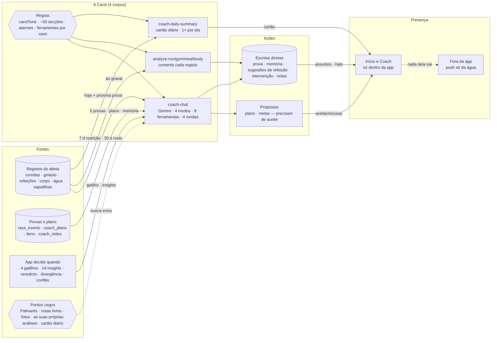

# Auditoria — a vida da Carol

> Data: 2026-09-18 · Base: `dev` em `abec7b8` · Método: grafo do graphify + leitura do código das Edge Functions e do cliente.
> Pergunta: a Carol é omnisciente e omnipresente?
>
> **Atualização 2026-09-18:** a Fase 1 de [carol-omnisciencia-omnipresenca.md](carol-omnisciencia-omnipresenca.md) fechou os achados A1, A5, A6 e A8. O chat passa a ler as análises por registo, o cartão diário, o Palmarés, as notas livres e as metas corporais. As análises e o cartão passam a ler a memória durável e a conversa recente. O resto deste documento descreve o estado antes dessa fase.

## Resposta curta

**Não é nenhuma das duas.** A Carol vê o atleta **por janelas fixas** e só fala **quando o atleta entra na app**. É, na melhor das hipóteses, *omni-reativa*: responde a tudo o que lhe chega, mas quase nada lhe chega sem o atleta abrir a porta.

## 1. Os quatro corpos

A "Carol" não é uma entidade: são **quatro Edge Functions** que partilham o tom (`_shared/carolTone.ts`) mas não partilham memória.

| Corpo | Quando corre | O que produz |
|---|---|---|
| `coach-chat` | Quando o atleta escreve, ou quando o cliente dispara um gatilho proativo ao abrir o chat | Resposta + chamadas a ferramentas |
| `analyze-run` / `analyze-gym` / `analyze-meal` / `analyze-body` | Ao gravar cada registo | `coach_notes` no próprio registo; `intervention_needed` (exceto corpo) |
| `coach-daily-summary` | Ao abrir o Início, 1× por dia (cache) ou forçado pelo botão | Recap, sugestão de refeição, prontidão para a prova, conceito do dia, avisos, preparação de amanhã |
| `estimate-shoe-lifespan` | Ao registar/editar sapatilhas | Estimativa de km de vida |

Só o `coach-chat` tem o "cérebro completo": modos, ferramentas, cenários e memória durável.

## 2. Inputs — o que ela vê

### 2.1 No chat (`coach-chat`)

| Fonte | Janela |
|---|---|
| Nutrição (refeições + `meal_items` com nutrientes) | 7 dias |
| Hábitos alimentares | 30 dias |
| Água | hoje |
| Ginásio (sessões + séries) | 30 dias |
| Corrida (com detalhes) | 30 dias |
| Corpo (avaliações) | 30 registos / 30 dias |
| Provas | de ontem em diante, máx. 5, com `web_info`, prioridade e id |
| Sapatilhas | ativas + km |
| Planos | propostos + ativo (20 itens) + plano vinculado à prova |
| Memória durável (`coach_notes` da tabela própria) | todas, 7 categorias |
| Conversa | últimas 30 mensagens |
| Payload do cliente | insights ativos (14 regras), gatilho proativo + detalhes, veredicto da prova, divergência do plano, conflito de provas |

Pode ir mais atrás com as ferramentas `get_*_history`. Prontidão, ACWR e nível medido chegam já calculados por fórmulas partilhadas — ela não os deduz, recebe-os.

### 2.2 Pontos cegos — o que nunca lhe chega

- **Palmarés** (`medal_awards`): não sabe que medalhas o atleta ganhou.
- **Notas livres do atleta** em corridas, sessões, refeições e provas.
- **Fotos, diploma, medalha, mural** da prova.
- **As suas próprias análises**: os `coach_notes` que a Carol das análises escreveu em cada registo não entram no contexto do chat.
- **O cartão diário**: o chat não sabe o que o cartão disse ao atleta nessa manhã.
- **Metas corporais** não estão no `select` do perfil.
- **Provas passadas** além de ontem (só via histórico, se ela decidir pedir).

**Consequência:** três memórias que não se falam. O atleta pode ler "cuidado com a proteína" no cartão, "boa corrida, mas o ritmo caiu" na análise, e depois o chat não sabe de nenhuma das duas.

## 3. Raciocínio — as regras que segue

1. **Tom absoluto** (`carolTone`): sem emojis, sem frases de manual, português de Portugal, direta.
2. **Modo do turno**, escolhido pelo servidor a partir dos dados: `PROVA_COM_PLANO`, `PROVA_SEM_PLANO`, `MANUTENCAO_COM_PLANO`, `LIVRE`.
3. **Ferramentas por caso de turno** (`allowedToolsFor`: A, F_PLAN, F_GOALS, B, C, D): nem todas as 9 ferramentas estão disponíveis em cada caso.
4. **Pré-filtro fora do tema**: recusa conversa que não seja treino, nutrição ou saúde.
5. **~50 secções de doutrina** no system prompt, incluindo **11 guiões de cenário** (manhã da prova, véspera, balanço, silêncio, conflito de provas, divergência, …).
6. **Hierarquia de alarmes** (prevalece sobre qualquer plano): G1 risco vital > G2 fratura de stress > G3 RED-S grave > G4 sobretreino > G5 lesão músculo-tendinosa. Só dispara se o atleta **mencionar** o sinal: ela não o deteta sozinha nos dados.
7. **Esquema de decisão** para propor plano: prova-objetivo obrigatória se houver principal, último dia = dia da prova, uma só principal por bloco.
8. **Regras impostas no servidor, não no prompt**: plano vinculado à prova validado em `runProposeTrainingPlan` (prova existe, não concluída, `period_end` = data; sem duas principais; bloco vinculado não é substituído por um sem prova).
9. **Limite de 4 rondas** de ferramentas por turno.

## 4. Ações — o que ela faz

| Ação | Via | Precisa de aceite? |
|---|---|---|
| Propor plano de treino | `propose_training_plan` | **Sim** |
| Propor metas | `update_goals` | **Sim** |
| Criar/editar prova (incl. `conflict_acknowledged`) | `update_race_event` | Não — grava já |
| Guardar memória | `save_coach_note` | Não |
| Guardar sugestões de refeição | `save_meal_suggestions` | Não |
| Resolver uma intervenção pendente | `resolve_intervention` | Não |
| Consultar histórico (corrida, ginásio, nutrição) | `get_running_history` · `get_gym_history` · `get_nutrition_history` | — (leitura) |
| Comentar cada registo | `analyze-*` → `coach_notes` | Não |
| Pedir intervenção | `analyze-run/gym/meal` → `intervention_needed` | Não — o Início obriga a decidir |
| Cartão diário | `coach-daily-summary` | Não (cache) |

## 5. Presença — onde está

- **Gatilhos proativos** (prioridade: manhã da prova > véspera > balanço pós-prova 7 d/3 d > silêncio 3 d) só disparam quando o atleta **abre o Coach** ou **toca no aviso do Início**. É um efeito passivo no `Coach.jsx`.
- **Deduplicação em `localStorage`**: por dispositivo. Trocar de telemóvel pode repetir a mesma mensagem; o servidor só trava 6 h (`PROACTIVE_QUIET_HOURS`).
- **Push**: o único que sai da app é o lembrete de água, "Hora de beber água 💧". Tem emoji e é frase de manual — exatamente o que o `carolTone` proíbe. **Não é a voz dela.**
- **Onboarding**: 6 passos conduzidos pela Carol.
- **Sugestão de nível para a prova** (`RaceLevelSuggestion`): é fórmula, não Carol, apesar de aparecer no mesmo espaço visual.

## 6. Achados

| # | Severidade | Achado | Sugestão |
|---|---|---|---|
| A1 | Alta | O chat não lê as análises por registo nem o cartão diário | Injetar os últimos N `coach_notes` dos registos e o cartão de hoje no contexto do chat |
| A2 | Alta | Nenhuma presença fora da app: uma prova amanhã não gera nenhum aviso se o atleta não abrir | Push da véspera/manhã da prova com texto da Carol (gerado no servidor, com tom) |
| A3 | Média | Push da água viola o tom | Reescrever o texto sem emoji, na voz dela |
| A4 | Média | Dedupe proativa em `localStorage` | Mover para o servidor (tabela ou coluna com o último gatilho enviado) |
| A5 | Média | Palmarés invisível | Incluir as medalhas recentes no contexto |
| A6 | Média | Notas livres do atleta invisíveis | Incluir as notas dos registos na janela |
| A7 | Baixa | `analyze-body` nunca pede intervenção | Decidir se uma variação corporal brusca deve pedir |
| A8 | Baixa | Metas corporais fora do perfil lido | Acrescentar ao `select` |
| A9 | Baixa | `RaceLevelSuggestion` parece Carol mas é fórmula | Distinguir visualmente ou passar pela Carol |

## 7. Onde é forte

- Comenta cada registo **no momento** em que é gravado, e pode marcar uma intervenção que o Início não deixa ignorar.
- Duas ações estruturais (plano, metas) exigem **sempre** o aceite do atleta.
- A regra do plano vinculado à prova é **imposta no servidor**, não depende de o modelo obedecer ao prompt.
- A memória durável (`coach_notes`) é lida inteira em cada conversa.

## Conclusão

A Carol é **consistente no tom** e **forte dentro da conversa**, mas não é omnisciente (vê por janelas e tem três memórias separadas) nem omnipresente (não existe fora da app e só acorda quando o atleta entra). Os achados A1 e A2 são os que mais a aproximariam da ideia de uma treinadora que "está sempre lá".
